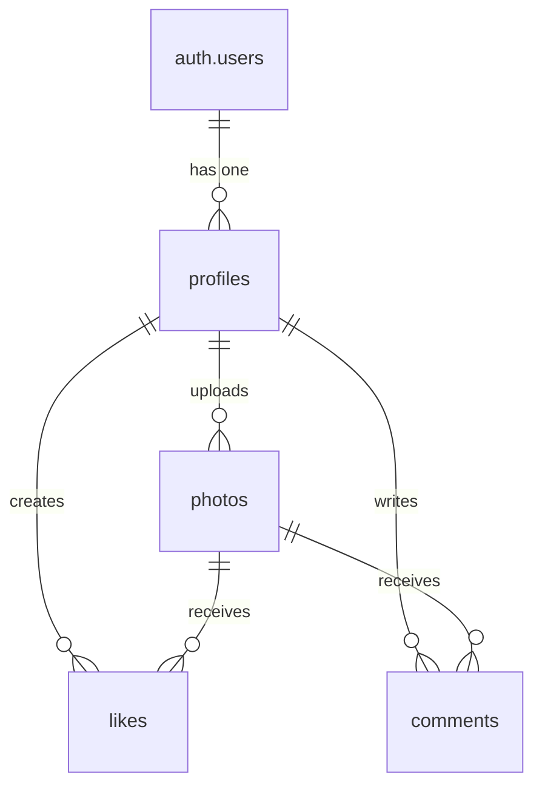
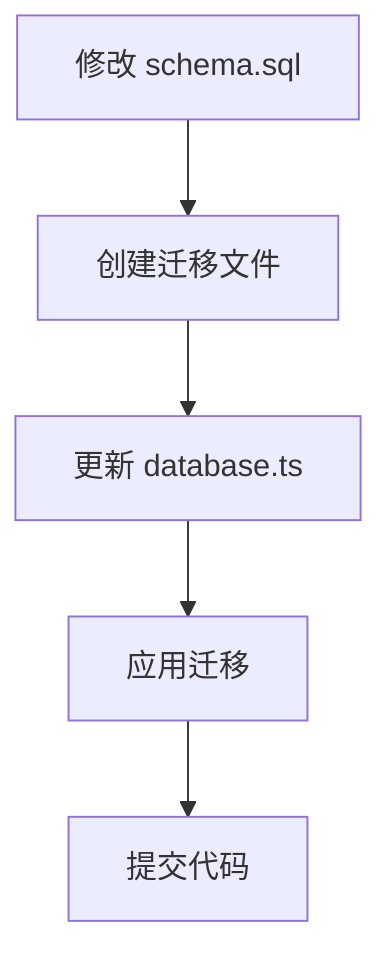

<!--
 * @Description: 
 * @Date: 2025-04-04 18:50:07
 * @LastEditTime: 2025-04-04 23:25:34
 * @FilePath: /framespot/supabase/README.md
 * @LastEditors: Xinyi Yan
-->
# Supabase 数据库管理

## 文件结构

```
supabase/
├── schema.sql           # 完整的数据库结构定义
├── migrations/          # 数据库变更记录
│   ├── YYYYMMDD_*.sql  # 按时间顺序的迁移文件
└── README.md           # 本文档
```

## 文件说明

1. **schema.sql**
   - 包含完整的数据库结构定义
   - 所有表、索引、策略等
   - 作为数据库结构的单一可信来源

2. **migrations/*.sql**
   - 按时间顺序的数据库变更记录
   - 每个文件代表一次变更
   - 文件名格式：`YYYYMMDD_description.sql`

3. **types/database.ts**
   - TypeScript 类型定义
   - 与数据库表结构一一对应
   - 用于代码中的类型检查

## 数据库表关系



## 如何使用

### 开发流程



### 首次设置

1. 重置远程数据库（⚠️ 会删除所有数据）：
```bash
supabase db reset
```

2. 应用完整的 schema：
```bash
supabase db push
```

### 修改数据库结构

1. 更新 `schema.sql`
2. 创建新的迁移：
```bash
supabase migration new <description>
```

3. 编辑迁移文件
4. 应用迁移：
```bash
supabase db push
```

### 查看当前状态

```bash
# 查看迁移历史
supabase migration list

# 查看数据库差异
supabase db diff
```

## 安全策略

所有表都启用了行级安全性(RLS)：
- 个人资料可以被所有人查看
- 用户只能修改自己的数据
- 照片和评论可以被所有人查看
- 点赞可以被所有人查看，但只能修改自己的

## 自动化功能

1. 新用户注册时自动创建个人资料
2. 更新数据时自动更新时间戳
3. 删除用户时自动删除相关数据（级联删除）

## 存储桶

1. `avatars`: 用户头像存储
   - 公开访问
   - 仅认证用户可上传
   - 用户只能更新自己的头像

2. `photos`: 照片存储
   - 公开访问
   - 仅认证用户可上传
   - 用户只能更新自己的照片

## 创建新的迁移

当需要修改数据库结构时：

1. 创建新的迁移文件：
```bash
supabase migration new <migration-name>
```

2. 编辑新创建的迁移文件
3. 应用迁移：
```bash
supabase db push
```

## 重置数据库

### 通过 SQL Editor 重置

1. 访问 [Supabase Dashboard](https://supabase.com/dashboard)
2. 选择你的项目
3. 点击左侧菜单中的 "SQL Editor"
4. 点击 "New Query" 创建新查询
5. 执行以下 SQL 命令：
   ```sql
   -- 删除应用表（保留 PostGIS 系统表）
   drop table if exists 
     public.comments,
     public.follows,
     public.likes,
     public.photos,
     public.profiles cascade;
   ```

### 重置后的操作

1. 验证表结构：
   ```sql
   -- 检查表是否创建成功
   select table_name 
   from information_schema.tables 
   where table_schema = 'public';
   ```

2. 验证存储桶：
   - 进入左侧菜单的 "Storage"
   - 检查是否存在 `avatars` 和 `photos` 两个存储桶
   - 如果不存在，点击 "New Bucket" 创建：
     1. 创建 `avatars` 存储桶，勾选 "Public bucket" 选项
     2. 创建 `photos` 存储桶，勾选 "Public bucket" 选项

⚠️ **注意事项**：
- 重置操作会删除所有数据，请确保已备份重要数据
- 重置不会影响 Auth 用户，但会删除关联的配置文件
- 建议在开发环境中进行测试后再在生产环境中操作 